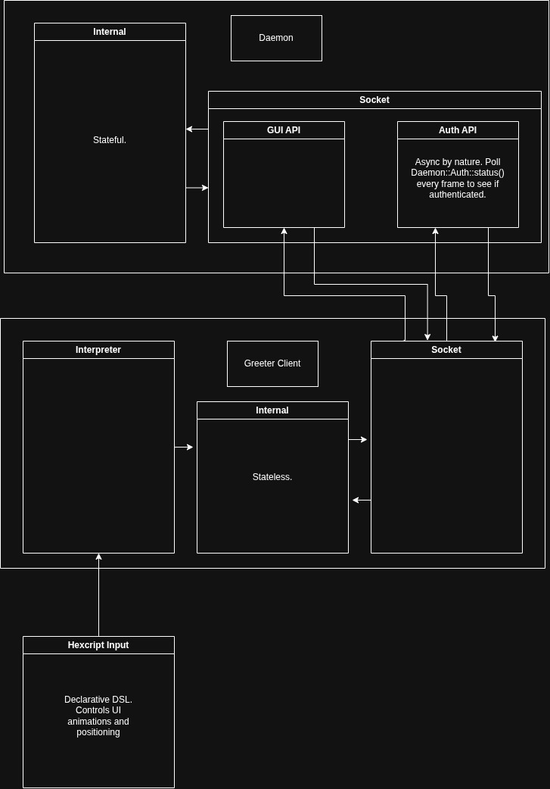

# HexDM

This is *not* a port of [HexDM-GO](https://github.com/tesinclair/HexDM-GO). This is a complete rewrite.

HexDM-GO was a quick and dirty POC to check if real time fingerprint
scanning would work without any janky keypresses, and it worked.

Now I am rewriting the whole thing from the ground up.

## Overview

The general overview can be seen here:

The design is simply principled: No one should need a full greeter to customise
their login experience.

Not only does this add security vulnerabilities, but means you must learn the
language of the greeter's daemon, their API and their architecture.

The goal of HexDM is to remove the need for 2/3 of this.

HexDM ships with a DSL called Hexcript, a declarative language
that allows you to fully design and animate your own Login Screen.

## Installation

It is literally not even started yet. Bit early for that...
